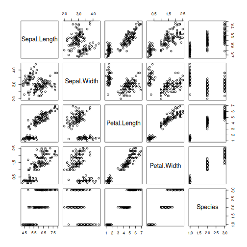

An Introduction to data manipulation in R
============================
transition: none
css: custom.css
autosize: true

Jessica L. O'Connell

Download/Install materials from **https://github.com/jloconnell/Intro_to_R**

Learning Objectives
==============
* why program/ why use R
* Base R suggestions


Learning Objectives
==============
* **why program/ why use R**
* Base R suggestions

Why program?
==========
* get more done in less time and with less pain
* a record of your data steps
* extensible, learn over time
* repeatable
* open source: puts the knowledge of the science community at your finger tips
* creative: if you can imagine it, you can probably program it

Which programming language?
============
* The one your colleagues already use
* An open source language (not MatLab)
  - “free as in beer”: 
     + it costs nothing
  - “free as in speech”: 
     + the right to see how the software works
     + the right to redistribute and improve/contribute
* We'll learn R today, but it's similar to other programming languages (Python, JavaScript)

Why R?
============
* It's a fully-featured programming language with rich statistics functions
* It's open-source
* It has many geospatial and machine learning libraries
 - "Yes, there's an R package for that"

Programming has a learning curve
============
* slow to create the first script
* fast to use the script to repeat the steps
* our goal is to learn:
  - some programming basics
  - create some code recipes
* you won't learn everything now; be patient with yourself

More resources
===============
* Cran: https://cran.r-project.org/manuals.html
* Swirl: R package that teaches R basics through easy interactive learning
* Software Carpentry: https://swcarpentry.github.io/r-novice-inflammation/
* Data Carpentry: https://datacarpentry.org/R-ecology-lesson/index.html
* Hadley Wickham, R for Data Science: https://r4ds.had.co.nz/


Learning Objectives
==============
* why program/ why use R
* **Base R suggestions**


Object-oriented programming basics
==============
* data are stored as objects
* data has types and structures
* functions: a set of steps to apply to data
* data can be read in from disk, manipulated via functions, and written out to disk
* plotting: data can be visualized, plots can be saved to disk
* for loops: quick repeating of steps
* if statements: conditional application of code- if condition met, then do something 

Base R advantages
===============
* it is worth **really** learning base R
* Every symbol in base R has one and only one meaning (see cheatsheat)
  - must learn when to use each
  - function(arg1=, arg2=)
  - the paraenthesis are only for functions, = is only for function arguments
  - use == for an equality (x == y, true or false); also <=; !=, <, etc (!= is does not equal)
  - use <- for object assignment
  - x <-10; read as 'x "store as" 10'
  - dat[1,2]; brackets are used for subsetting, here we grab a cell out of dataset dat
  - iris[iris$Sepal.Length<5, ], subsets data iris to rows where column sepal length is <5
  
Base R spacing
====================
* R doesn't care about spaces, those are for you 
* you can split code statements across multiple lines or not, as you like
* R only cares that you opened a statement and closed it properly 
  - eg: function() text string" " or { }
* To put more than one function on the same line, use ;
  -plot(1:10, 5:14); print('hi')
  
Most useful functions
===============
* get very comfortable with functions that help you visualize and summarize data

``` r
data("iris")
##get the dimensions of a data frame
dim(iris); nrow(iris); ncol(iris)
```

```
[1] 150   5
```

```
[1] 150
```

```
[1] 5
```

``` r
##get the length of a vector
length(iris$Species)
```

```
[1] 150
```

``` r
#see everything plotted against everything
plot(iris)
```



Most useful functions: summary fxns
===============

``` r
#get the names of rows and columns
names (iris); colnames(iris); rownames(iris)
```

```
[1] "Sepal.Length" "Sepal.Width"  "Petal.Length" "Petal.Width"  "Species"     
```

```
[1] "Sepal.Length" "Sepal.Width"  "Petal.Length" "Petal.Width"  "Species"     
```

```
  [1] "1"   "2"   "3"   "4"   "5"   "6"   "7"   "8"   "9"   "10"  "11"  "12" 
 [13] "13"  "14"  "15"  "16"  "17"  "18"  "19"  "20"  "21"  "22"  "23"  "24" 
 [25] "25"  "26"  "27"  "28"  "29"  "30"  "31"  "32"  "33"  "34"  "35"  "36" 
 [37] "37"  "38"  "39"  "40"  "41"  "42"  "43"  "44"  "45"  "46"  "47"  "48" 
 [49] "49"  "50"  "51"  "52"  "53"  "54"  "55"  "56"  "57"  "58"  "59"  "60" 
 [61] "61"  "62"  "63"  "64"  "65"  "66"  "67"  "68"  "69"  "70"  "71"  "72" 
 [73] "73"  "74"  "75"  "76"  "77"  "78"  "79"  "80"  "81"  "82"  "83"  "84" 
 [85] "85"  "86"  "87"  "88"  "89"  "90"  "91"  "92"  "93"  "94"  "95"  "96" 
 [97] "97"  "98"  "99"  "100" "101" "102" "103" "104" "105" "106" "107" "108"
[109] "109" "110" "111" "112" "113" "114" "115" "116" "117" "118" "119" "120"
[121] "121" "122" "123" "124" "125" "126" "127" "128" "129" "130" "131" "132"
[133] "133" "134" "135" "136" "137" "138" "139" "140" "141" "142" "143" "144"
[145] "145" "146" "147" "148" "149" "150"
```

Most useful functions: summary fxns
===============

``` r
#what kind of object is iris and it's constituent columns
class(iris)
```

```
[1] "data.frame"
```

``` r
class(iris$Species)
```

```
[1] "factor"
```

``` r
class(iris$Sepal.Length)
```

```
[1] "numeric"
```

Most useful functions: summary fxns
===============

``` r
##summarize a data frame and see column data types
table(iris$Species)
```

```

    setosa versicolor  virginica 
        50         50         50 
```

``` r
summary(iris)
```

```
  Sepal.Length    Sepal.Width     Petal.Length    Petal.Width   
 Min.   :4.300   Min.   :2.000   Min.   :1.000   Min.   :0.100  
 1st Qu.:5.100   1st Qu.:2.800   1st Qu.:1.600   1st Qu.:0.300  
 Median :5.800   Median :3.000   Median :4.350   Median :1.300  
 Mean   :5.843   Mean   :3.057   Mean   :3.758   Mean   :1.199  
 3rd Qu.:6.400   3rd Qu.:3.300   3rd Qu.:5.100   3rd Qu.:1.800  
 Max.   :7.900   Max.   :4.400   Max.   :6.900   Max.   :2.500  
       Species  
 setosa    :50  
 versicolor:50  
 virginica :50  
                
                
                
```

``` r
str(iris)
```

```
'data.frame':	150 obs. of  5 variables:
 $ Sepal.Length: num  5.1 4.9 4.7 4.6 5 5.4 4.6 5 4.4 4.9 ...
 $ Sepal.Width : num  3.5 3 3.2 3.1 3.6 3.9 3.4 3.4 2.9 3.1 ...
 $ Petal.Length: num  1.4 1.4 1.3 1.5 1.4 1.7 1.4 1.5 1.4 1.5 ...
 $ Petal.Width : num  0.2 0.2 0.2 0.2 0.2 0.4 0.3 0.2 0.2 0.1 ...
 $ Species     : Factor w/ 3 levels "setosa","versicolor",..: 1 1 1 1 1 1 1 1 1 1 ...
```

Most useful functions: summary fxns
===============

``` r
##see inside a data frame, first and last rows
head(iris) ##first 5 rows
```

```
  Sepal.Length Sepal.Width Petal.Length Petal.Width Species
1          5.1         3.5          1.4         0.2  setosa
2          4.9         3.0          1.4         0.2  setosa
3          4.7         3.2          1.3         0.2  setosa
4          4.6         3.1          1.5         0.2  setosa
5          5.0         3.6          1.4         0.2  setosa
6          5.4         3.9          1.7         0.4  setosa
```

``` r
tail(iris) ##last 5 rows
```

```
    Sepal.Length Sepal.Width Petal.Length Petal.Width   Species
145          6.7         3.3          5.7         2.5 virginica
146          6.7         3.0          5.2         2.3 virginica
147          6.3         2.5          5.0         1.9 virginica
148          6.5         3.0          5.2         2.0 virginica
149          6.2         3.4          5.4         2.3 virginica
150          5.9         3.0          5.1         1.8 virginica
```


What files do we use for code?
=============================
* scripts: a text file of computer instructions/ data steps, .txt, .r, .R, .js, .py
  - you can source as script to run all its code at once 
  - source(myscript.r)
  - I usually put these scripts in the functions folder for the project with my custom functions
* R markdown: mixes text and code for generating reports, manuscripts and vignettes
  - can write your whole science manuscript with R Markdown


