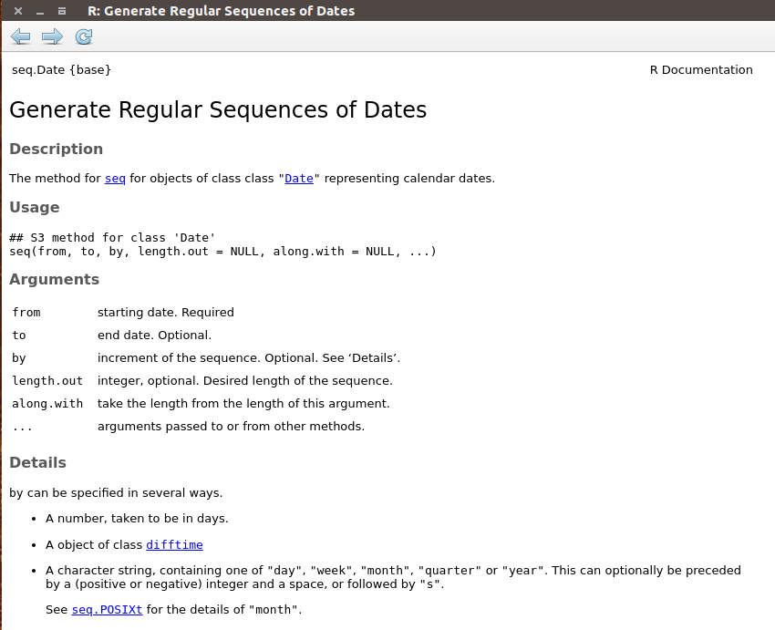
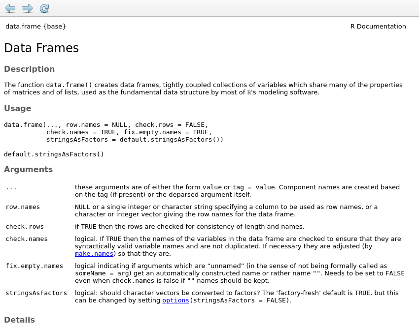

R Programming: Functions, and control structures
========================================================
autosize: true
transition: none
css: custom.css

Learning Objectives
==============
* functions: what to do?
* control structures: 
  - for loop: how many times to repeat?
  - if: when to do it?

Learning Objectives
==============
* **functions**: what to do?
* control structures: 
  - for loop: how many times to repeat?
  - if: when to do it?

Functions: what to do
==============
* Every data step is accomplished with functions
* You can use built-in functions or define your own
* Functions are a set of steps that are named and saved to use later

Functions: what to do
==============
* How to define a function, psuedo-code:

myfunction <- function(arg1, arg2 = default2) **{**

    take arguments as inputs
    do some data steps involving the arguments
    return(an object)
  
**}**

* arg1 must be supplies, has no default
* arg2 will take on the default if you don't redefine it

Functions: what to do
==============
* How to define a function, psuedo-code:

myfunction <- function(arg1, arg2 = default2) **{**

    take arguments as inputs
    do some data steps involving the arguments
    return(an object)
  
**}**

* How to apply a function, psuedo-code:

        x <- myfunction(arg1, arg2 = default2)

* This will apply the data steps to arg1 and 2 and save the outcome as x


Functions: what to do
==============
* an example function


``` r
half.it<- function(x) {
  y<-x/2
  return(y)
}

myvector<-1:10
myvector
```

```
 [1]  1  2  3  4  5  6  7  8  9 10
```

``` r
new.vect<-half.it(myvector)
new.vect
```

```
 [1] 0.5 1.0 1.5 2.0 2.5 3.0 3.5 4.0 4.5 5.0
```

Functions: Explore some known functions
==============
* type ?**function** at the command line to get its help page
* ex: ?seq.Date
* type **function** at the command line to print the function code


Functions: Explore some known functions
==============
* ex: seq.Date()

``` r
?seq.Date
```




Functions: Explore some known functions
==============
* Take a moment to explore the help of some other functions, check the bottom of the help for examples

Functions: Arguments
==============
* if you call the arguments in the default order, there's no need to specify the argument name
* if you call them out of order, you need to specify the argument name
* you can use the beginning of the argument name

Functions: Arguments
==============
* valid ways to write function arguments

``` r
##specify all argument names
seq.Date(from=as.Date("2019-01-01"),to=as.Date("2019-01-10"), by=2)
```

```
[1] "2019-01-01" "2019-01-03" "2019-01-05" "2019-01-07" "2019-01-09"
```

``` r
##leave argument names out, but put argments in the right order
seq.Date(as.Date("2019-01-01"),as.Date("2019-01-10"), 2)
```

```
[1] "2019-01-01" "2019-01-03" "2019-01-05" "2019-01-07" "2019-01-09"
```

``` r
##specify argments in a differnt order, use just the beginining of the arg. name
seq.Date(t=as.Date("2019-01-10"),f=as.Date("2019-01-01"), b=2)
```

```
[1] "2019-01-01" "2019-01-03" "2019-01-05" "2019-01-07" "2019-01-09"
```

Functions: Arguments
==============
* arguments without defaults are required


``` r
seq.Date(from=as.Date("2019-01-01"),to=as.Date("2019-01-10"))
```

```
Error in seq.Date(from = as.Date("2019-01-01"), to = as.Date("2019-01-10")): exactly two of 'to', 'by' and 'length.out' / 'along.with' must be specified
```

* note that the error messages are useful
* try searching the internet with the extact text of an error message


Functions: Arguments
=============
* arguments with defaults will be set for you if you don't change them


``` r
?data.frame
```
  

  
Functions: Arguments
==============
* arguments with defaults will be set for you if you don't change them
* data.frame will default to setting characters as factors


``` r
dat<-data.frame(id=c("a","b", "c"), x=1:3)
str(dat)
```

```
'data.frame':	3 obs. of  2 variables:
 $ id: chr  "a" "b" "c"
 $ x : int  1 2 3
```

``` r
dat
```

```
  id x
1  a 1
2  b 2
3  c 3
```
  
Factors: A quick warning
==============
* character vectors as factors are useful in some situations (models), but are often interpreted by functions as the underlying integers
  

``` r
  dat$id<-factor(dat$id)
  str(dat)
```

```
'data.frame':	3 obs. of  2 variables:
 $ id: Factor w/ 3 levels "a","b","c": 1 2 3
 $ x : int  1 2 3
```

``` r
  dat$id<-ifelse(dat$id=="a","z",dat$id)
  dat ##see that the factor levels have been inserted
```

```
  id x
1  z 1
2  2 2
3  3 3
```

``` r
  dat<-data.frame(id=letters[1:3], x=1:3)
  dat$id<-ifelse(dat$id=="a","z",as.character(dat$id))
  dat
```

```
  id x
1  z 1
2  b 2
3  c 3
```

Class: it's useful to know it
==============
* as shown in the last example, many errors happen when a function expects one kind of data, but you gave another
* class() is your friend, to figure out what type of data you started with, what you ended up with
  - ?function will tell what kind of data was expected
  - there are many functions to convert to a new data type [ as.character(), as.interger(), as.matrix(), etc]
  - that is how you solve this kind of problem


Functions: See the source code
==============
* your function half.it and the base r function rowMeans


``` r
half.it
```

```
function (x) 
{
    y <- x/2
    return(y)
}
```

``` r
rowMeans
```

```
function (x, na.rm = FALSE, dims = 1L) 
{
    if (is.data.frame(x)) 
        x <- as.matrix(x)
    if (!is.array(x) || length(dn <- dim(x)) < 2L) 
        stop("'x' must be an array of at least two dimensions")
    if (dims < 1L || dims > length(dn) - 1L) 
        stop("invalid 'dims'")
    p <- prod(dn[-(id <- seq_len(dims))])
    dn <- dn[id]
    z <- if (is.complex(x)) 
        .Internal(rowMeans(Re(x), prod(dn), p, na.rm)) + (0+1i) * 
            .Internal(rowMeans(Im(x), prod(dn), p, na.rm))
    else .Internal(rowMeans(x, prod(dn), p, na.rm))
    if (length(dn) > 1L) {
        dim(z) <- dn
        dimnames(z) <- dimnames(x)[id]
    }
    else names(z) <- dimnames(x)[[1L]]
    z
}
<bytecode: 0x5bcd94049b50>
<environment: namespace:base>
```

Functions: Explore some known functions
==============
* ex: seq.Date(), see the source code

``` r
seq.Date
```

```
function (from, to, by, length.out = NULL, along.with = NULL, 
    ...) 
{
    if (missing(from)) 
        stop("'from' must be specified")
    if (!inherits(from, "Date")) 
        stop("'from' must be a \"Date\" object")
    if (length(as.Date(from)) != 1L) 
        stop("'from' must be of length 1")
    if (!missing(to)) {
        if (!inherits(to, "Date")) 
            stop("'to' must be a \"Date\" object")
        if (length(as.Date(to)) != 1L) 
            stop("'to' must be of length 1")
    }
    if (!missing(along.with)) {
        length.out <- length(along.with)
    }
    else if (!is.null(length.out)) {
        if (length(length.out) != 1L) 
            stop("'length.out' must be of length 1")
        length.out <- ceiling(length.out)
    }
    status <- c(!missing(to), !missing(by), !is.null(length.out))
    if (sum(status) != 2L) 
        stop("exactly two of 'to', 'by' and 'length.out' / 'along.with' must be specified")
    if (missing(by)) {
        from <- unclass(as.Date(from))
        to <- unclass(as.Date(to))
        res <- seq.int(from, to, length.out = length.out)
        return(.Date(as.numeric(res)))
    }
    if (length(by) != 1L) 
        stop("'by' must be of length 1")
    valid <- 0L
    if (inherits(by, "difftime")) {
        by <- switch(attr(by, "units"), secs = 1/86400, mins = 1/1440, 
            hours = 1/24, days = 1, weeks = 7) * unclass(by)
    }
    else if (is.character(by)) {
        by2 <- strsplit(by, " ", fixed = TRUE)[[1L]]
        if (length(by2) > 2L || length(by2) < 1L) 
            stop("invalid 'by' string")
        valid <- pmatch(by2[length(by2)], c("days", "weeks", 
            "months", "quarters", "years"))
        if (is.na(valid)) 
            stop("invalid string for 'by'")
        if (valid <= 2L) {
            by <- c(1, 7)[valid]
            if (length(by2) == 2L) 
                by <- by * as.integer(by2[1L])
        }
        else by <- if (length(by2) == 2L) 
            as.integer(by2[1L])
        else 1
    }
    else if (!is.numeric(by)) 
        stop("invalid mode for 'by'")
    if (is.na(by)) 
        stop("'by' is NA")
    if (valid <= 2L) {
        from <- unclass(as.Date(from))
        if (!is.null(length.out)) 
            res <- seq.int(from, by = by, length.out = length.out)
        else {
            to0 <- unclass(as.Date(to))
            res <- seq.int(0, to0 - from, by) + from
        }
        res <- .Date(as.numeric(res))
    }
    else {
        r1 <- as.POSIXlt(from)
        if (valid == 5L) {
            if (missing(to)) {
                yr <- seq.int(r1$year, by = by, length.out = length.out)
            }
            else {
                to0 <- as.POSIXlt(to)
                yr <- seq.int(r1$year, to0$year, by)
            }
            r1$year <- yr
            res <- as.Date(r1)
        }
        else {
            if (valid == 4L) 
                by <- by * 3
            if (missing(to)) {
                mon <- seq.int(r1$mon, by = by, length.out = length.out)
            }
            else {
                to0 <- as.POSIXlt(to)
                mon <- seq.int(r1$mon, 12 * (to0$year - r1$year) + 
                  to0$mon, by)
            }
            r1$mon <- mon
            res <- as.Date(r1)
        }
    }
    if (!missing(to)) {
        to <- as.Date(to)
        res <- if (by > 0) 
            res[res <= to]
        else res[res >= to]
    }
    res
}
<bytecode: 0x5bcd94e338a0>
<environment: namespace:base>
```

Functions: what to do
==============
* Can make your own functions as complicated as you like


``` r
calc_index_l8<-function(dat.frame){
  ##This function assumes it is supplied with a data frame
  ##This function needs a data frame with Landsat 8 bands as columns
  ##The data frame should have the column names b1 for band1, etc.
  ##The function will return remote sensing indices: NDVI, a Simple Ratio, SAVI
  
  ndvi<-(dat.frame$b5-dat.frame$b4)/(dat.frame$b5+dat.frame$b4) 
  indices<-data.frame(ndvi=ndvi)
  indices$sr<-(dat.frame$b5/dat.frame$b4)
  indices$savi <- 1.5*(dat.frame$b5-dat.frame$b4) /
                  (dat.frame$b5+dat.frame$b4+0.5)
  return(indices)
}
```

Functions: R practice on your own
==============
* With the last example as a code recipe, define a function that calculates broadband greenness veg indices
  - for equations, use https://www.nv5geospatialsoftware.com/docs/BroadbandGreenness.html
  - pick at least three
  - do this for landsat 8 bands; you can find the band number table here:
    https://developers.google.com/earth-engine/datasets/catalog/LANDSAT_LC08_C02_T1_L2#bands
    - note that table defines band names as SR_Bx, to indicate surface reflectance band 1- 7
    - wavelengths and band descriptions are also there. For your function, use "b1" to indicate band 1 and use the band descriptions to cross reference the broad band equations with your band table

* Bonus: make a fake dataset called dat, with column names b1, b2...b7; apply your function to it
  - functions need to do this are data.frame, perhaps rnorm
* How can you add these indices as columns in your data? (see the combining data slides or the excel cheat sheet)
* try this later as practice on your own


Learning Objectives
==============
* **functions**: what to do?
* control structures: 
  - **for loop**: how many times to repeat?
  - if: when to do it?

Control Structures: for
==============
* Tells the computer to repeat something 
* psuedo-code:

for( val in sequence ) **{**

    do some data steps on x[val]
    
**}**

* above, val will take on the sequence values, iterating each time through the loop

Control Structures: for
==============

``` r
x<-letters[1:3]
x
```

```
[1] "a" "b" "c"
```

``` r
for(i in x){
  print(paste("this one was", i))
}
```

```
[1] "this one was a"
[1] "this one was b"
[1] "this one was c"
```

Control Stuctures: for
==============
* Practice: create your own for loop
 come up with a loop that will just print the value of i 10 times

* psuedo-code:

for( ) **{**

     print(           )
    
**}**


Control Stuctures: for
==============
* can use for loops to collect a result

``` r
## a loop to collect a new result
x<-1:10

##intialize a result vector
result<-0
for(i in 1:length(x)){
  result[i]<- x[i]*x[i]
  print(paste("i is", i, "and result[i] is", result[i]))
}
```

```
[1] "i is 1 and result[i] is 1"
[1] "i is 2 and result[i] is 4"
[1] "i is 3 and result[i] is 9"
[1] "i is 4 and result[i] is 16"
[1] "i is 5 and result[i] is 25"
[1] "i is 6 and result[i] is 36"
[1] "i is 7 and result[i] is 49"
[1] "i is 8 and result[i] is 64"
[1] "i is 9 and result[i] is 81"
[1] "i is 10 and result[i] is 100"
```

``` r
result
```

```
 [1]   1   4   9  16  25  36  49  64  81 100
```

For loop: practice
==============
* see if you can plot the iris data with different colors by species via a for loop

``` r
colors<-c("red", "blue", "green")
x<-unique(iris$Species)
plot(iris$Sepal.Length[iris$Species=="setosa"], 
     iris$Sepal.Width[iris$Species=="setosa"], 
     xlab= "Sepal Length (mm)", ylab= "Sepal Width (mm)", 
     pch=19, col=colors[1])
```
for( i in ??){

    points(    some code here that plots points for other the species  )
}

* hint: replace ?? with a sequence, 
* hint: for the points code, start with the code for adding points for one species 
* you can also use the x vector we created in the first code chunk to index the species; to see this, try x[1] and x[i]


For loop: more practice
==============
* see if you store the R squared results of multiple linear models in a vector called results
* use the iris data set and regress Sepal Length against the other numeric vectors in turn

``` r
library(broom)
summary(m<-lm(Sepal.Length ~Sepal.Width, data=iris))
glance(m)
rsq<-glance(m)[1]

result<-0
##for(i in ????:????)){
##  summary(m<-lm(iris$Sepal.Length ~iris[,???]))
##  result[i]<- glance(m)[1]
##  print(paste("i is", i, "and result[i] is", result[i]))
##}
result
```
